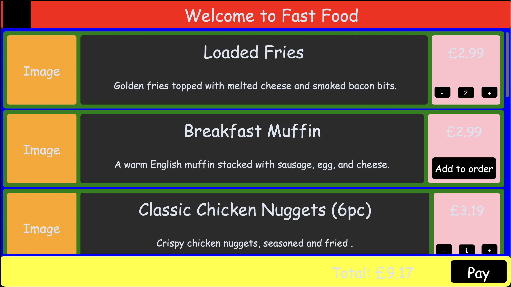
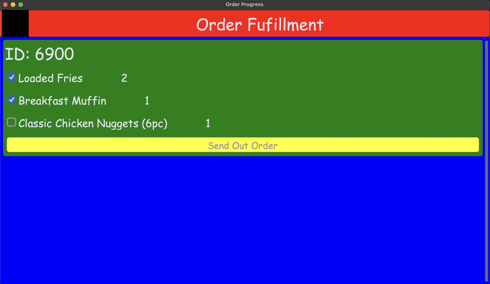
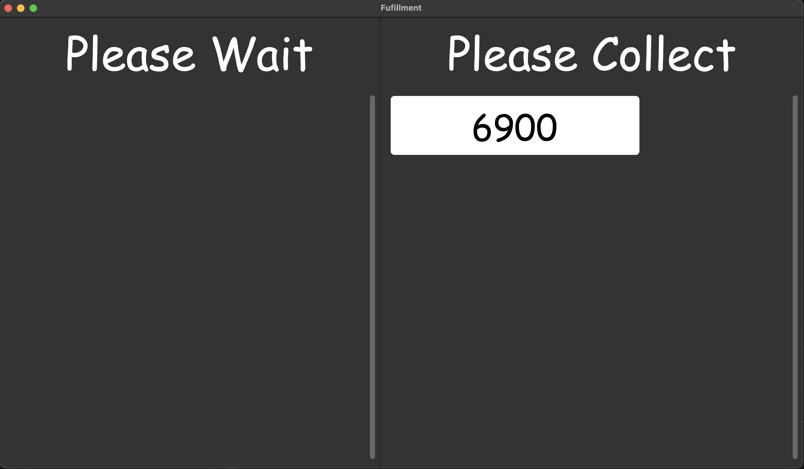

# CustomTkinter Fast Food System

A Python ordering and  GUI built with CustomTkinter, simulating a fast-food ordering setup.

## Features
- Select items from a menu
- Select Quantity of items
- Subit order to a database
- Retreive orders from a database
- Update Order Status
- Send out order for collection
- View orders that are being made
- Allow customers to collect orders

## Screenshots

<details>
<summary>Click to view Ordering Page</summary>

### Order Page

</details>

<details>
<summary>Click to view Ordering Page</summary>

### Fufullment Page

</details>

<details>
<summary>Click to view Ordering Page</summary>

### Progress Page


</details>

## Requirements
- Python(tested) 3.13.7+
- [CustomTkinter](https://github.com/TomSchimansky/CustomTkinter)
- [Pillow](https://github.com/python-pillow/Pillow)

Install dependencies:
```bash
pip install customtkinter
pip install pillow
python launcher.py

```

